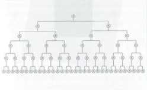
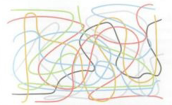
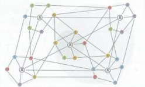

# 01 米哈游是天堂，搞不好也是地狱

    miHoYo是一个有的独特文化、理念及做事行为喜好倾向的地方。尽管这么听起来显得很不“专业”。相信在很多其他公司入职后，会有人告诉你，公司大了，要学着与那些你不喜欢的人也能合作。但在miHoYo我们会告诉你，我们是一群什么人，追求着什么，有哪些行为是要受到鼓励的，哪些行为是坚决不能存在的。你觉得好，come and join us，你觉得不好，我们同样会很尊重你，只是这里可能不适合你。

## 1.1 我们从来都不是一家游戏公司

“miHoYo不是一家游戏公司”

在你看到这一句话之前，或许已经不止一遍的听说过，可能是面试官在回答问题的时候说到的，也可能是跟某个同学聊天时候讲到的，又或许是江湖上的传言（emmm......我最希望是这种形式2333），当然也可能这是你第一次看到它。

经常会有人问我，一家收入90%来自游戏的公司，为啥不是一家游戏公司？

嗯，如果按照这个标准，倒是无话可说。因为同理，企鹅也是游戏公司，万代是个游戏+塑料小人公司，Facebook、Google、Baidu都是广告公司。

为什么我们说自己不是一家游戏公司，即使大多数钱都是通过游戏赚来的呢？

简单来说，确实很多公司，特别是传统工业农业企业，用户花钱买的就是它直接生产的东西。但是到了服务业和互联网领域，有些商业模式就变得微妙了起来。比如，某些互联网公司，大量用户都是免费使用其产品的，而其营收可能来自于广告商或其他业务，这就不举例说明了。另一方面，在交易这一环节的背后，是什么动机，什么日的，让用户去使用或付费，则是个更加复杂的同题。所以，不能简单的因为我们的主要收入来自游戏。就认定我们完全是一家卖游戏的公司。（昨不说我们是卖水晶的公司呢？）

更深入的原因，有如下三点：

1. 我们要几十年经营下去的是IP，而不是一款游戏；
2. 我们是一家科技公司、科技公司、科技公司（重要的话说三遍）；
3. miHoYo从来不把“游戏”当“游戏”看。

逐一解释下。

先说IP这件事。miHoYo创立的初心，是希望有一天，我们可以像Macross、EVA、The Matrix那样，创造出一个IP，在一代人的心中，留下永生不灭的回忆。就像当年Macross初代教会了我什么是三角恋。EVA让我入了香党，而Matrix则成了我们公司为之奋斗的终极目标。在创立miHoYo之前，其实我也尝试过动画、漫画，但在那个时候，于环境和个人能力来说，并不足以实现。所以，当我们开始选择以游戏作为产品形态的时候起，我们在想的是如何把这件事情做到二十年、五十年，甚至更久。单一的游戏产品会老，但IP可以很持久。

再说为什么我们是一家科技公司。首先，miHoYo这家公司的创划人，是三位交大计算机（CS）、电子工程（EE）的理工男，我们一直有着对科技的原生追求。其次，我们一直认为，每次文化与娱乐体验的重要升级，都依托在技术革命的基础上。同样，现在人类所掌握的科技还不足以实现我们最终的目标，所以，我们需要研发新的科技来实现。

最后来说下此“游戏”与彼“游戏”的差异。游戏于miHoYo来讲意味什么？首先它是我们重要内容与IP的载体，我们的用户会通过过游戏认识我们的角色、了解我们的故事与世界观，这些看似是影视与文学作品中实现的事情，我们的游戏也同样承载。其次，游戏作为游戏本身，必绿要实规其好玩的价值。最后，游戏当然是我们重要的商业化手段，但深究付费的动机，我们希望更多的是出于对IP的认同，对角色的喜爱，而不仅仅是数值变强。

其实，解释这么多，并不是希望别人改变对我们的看法，只要我们自己认定这件事，并持续努力，总有一天，当他们再次看到我们的产品的时候，会忍不住犹疑————

这好像不只是一款游戏了吧？

## 1.2 这可不是一家正经公司

我先罗列三个事实。

问：哪家公司的老板是被怒**次数最多的？  
答:miHoYo的大伟哥。

问：哪家公司老板的办公室是最大的？  
答：miHoYo，因为一整层趣过2000m²都是老板的办公室，我们跟200多位同学共享一个大平层，没有隔断，没有玻璃门。

问：我们公司的组织结构是啥样的?  
答：请看下面的图解。

常见大公司的组织结构图（树状图）：  
*见右侧

miHoYo的组织结构图：

啊，上面那个是草图，我啦正经画一下。

这就是我们中二的组织结构图：

为什么我们是扁平的、自组织的网状结构？又有什么在支撑着这种形式？这就是我现在要解释的事情。

树状组织结构是我们最常见的大公司的形态，也是一种执行效率蛮高的组织形态。除了大公司，军队等各种常见机构都可以看到清淅的树状组织结构图。在这种结构下，每一个叶子节点只需关注及做好局部的事情即可，如果碰到决策问题，则会层层向上汇报，有问题直到最终根节点才会被解决，然后再层层传递下去，被层层执行。

我们的组织结构，有书上把它称作网状结构，但不同于一般的去中心化网状绍构，我们是有局部中心的网状结构。一种我比较喜欢的叫法是：Team of Teams，如字面意思所言，这样一个大的组织，是由几个到十几个相对独立的Teams构成的，每个Team有一个局部中心。在沟通与决策过程中，每个局部中心会解决自己的局部问题，当涉及到其他部分的时候，这些局部中心可以主动与其它局部中心建立沟通，协同决策。在保证信息足够全局同步的基础上，大多数问题都可以在局部中心，或者几个局部中心的协同下决策解决。

这样的组职要运作良好其实对Team的核心节点有着更高的要求。

1. 每一个Team的局部中心（可能是1-2个人），需要有全局的信息、全局的认知，在信息缺乏的时候主动获取其它Team的信息；
2. 每一个Team的恩考与决策，需要严格基于信息与逻辑；
3. 每一个Team都需要在必要时主动与其它Team进行沟通，协同决策。

当然，除了Team的局部中心外，任何问题、任何一个人，都以在组织或者跨越Team之间，直接与其他人进行沟通，建立联系。

那么，为什么我们会选择这样一种组织方式？级者说，这不是种选择，而是公司发展过程中的自然进化方向。

相比树状结构，Team of Teams。越最近一线的节点，越具有决策力，也就是很多的决策，是来自于一线创作者，而不是高高在上的管理层。

这正是我们最在意的一点，大家都知道我们在做的。是希望年轻人喜欢的创意产品。我们相信，最接近用户的人、在一线制作产品的人，是最清楚什么才是美的，什么才是大家喜欢的，因为这也是我们自己所喜欢的。在miHoYo，每一个人都是创作者。每一个人都在创作用户喜欢、我们也喜欢的东西，都在尝试在白己最懂的专业领域去突破，做出别人做不出的东西。所以，最懂的人，才是应该拍板的那个人。

当然，Team of Teams也有它的缺点。我们在这种组织里需要更高的沟通成本，更高的节点能力。而就单纯执行这许事情来讲，或许并不如树状结构高效。但是，敏捷>效率，这就是我们的选择。

扁平，不意味着我们是一棵比较宽大的树，每层叶子节点比较多，不是这样。扁平，意味着这是一个每个节点可以自主决策，自主进化的组织。Team本身也是在演化、变化的。

当然，扁平还意味着。我们认为在miHoYo，人人平等，我们尊重每一个同学。
