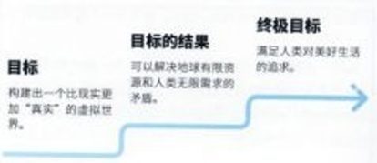
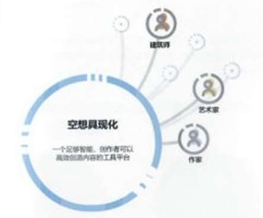
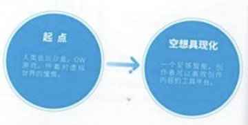
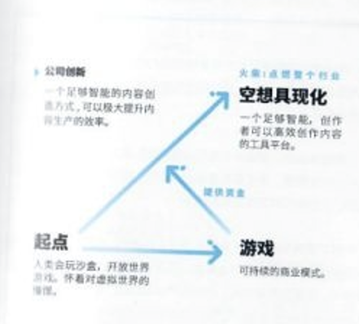
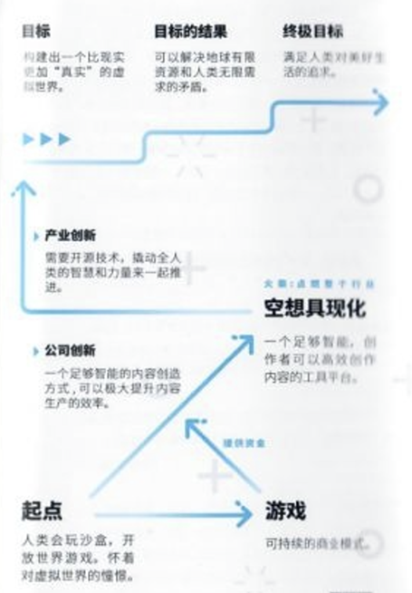

# 04 现在，我们来谈谈技术宅拯救世界
    “技术宅拯救世界”，这是我们公司的使命，也是我们的口号。或许你会觉得它只是在宣告一种我们的态度和模糊的方向。但其实，技术宅拯救世界，也是一个非常明确的RoadMap，一个关于miHoYo最终愿景的，Big Picture。

## 4.1 有一个地方，叫崩坏神域

在miHoYo有一个流传已久的都市传说，就是崩坏神域。或许有时候你会在公司听人提起，"woc， 那不就是崩坏神域了吗！ ？”或者“实在不行我们这个项目名字，就叫崩坏神域了吧233……”之类的。

崩坏神域，这个类似SAO或者The Matrix的东西，好像说起来大家都知道，但又从来没见有一个严谨的定义，它存在于每个人的脑中，但好像又不尽相同。

没错，从概念上来说，崩坏神域就代表着一个像SAO一样，或者The Matrix一样的沉浸世界。请注意，我刻意越开了使用“虚拟”这个词，而用了“沉浸”。因为在我看来，到了那个时候，所谓“真实”的定义会变得模糊。崩坏神域真正能达成的一个重要标准就是，让人难以分清：我肉身所在的世界，和我意识沉浸的那个世界，究竟哪个才更像是我想要生活的，或者两个都是。所以，探讨虚拟与真实根本不重要。重要的是，确实有能力构建出这样的一个世界，它的沉浸感能堪比我们肉身所在的这个世界。

同样，我也不打算在这里具体描述这个世界长啥样。一方面它离我很远，我讲不清。就算讲了，也不会是他被实现出来的样子。另一方面，我坚信，一千个人心中有一千个哈姆雷特。而这个崩坏神域也应该不止一个，这正是虚拟世界堪比现实的优势：可以不受现实物理的制约，更好的满足不同人的需求。也许你们是同一种追求的人群，你们就可以住在一个很适合你们的想象的世界里，而与你们需求有明显矛盾分歧的另一群人，住在另一个世界里就好了。

如果一定要给一个明确定义的话，我认为，崩坏神域的意思就是，一个沉浸感堪比现实，并且让人（或特定的某一群人）愿意生活其中的世界。崩坏神域可能是多个不同的世界。而miHoYo的终极愿景就是：把它造出来。

    目标：构建出一个比现实更加“真实”的虚拟世界

或许有的人会说，那miHoYo的终极愿景不是会混淆现实吗？技术是中立的，怎么使用技术服务于人类应该是独立技术本身的一个问题。 而在我们还距离崩坏神域诞生不知道几十年的今天，我更关注如何缩短这个技术上的差距。

另外，如果畅想一下的话。我可能会想。崩坏神域和支持它诞生的技术。其实是通往人类对美好生活追求的重要阶梯。因为现实世界，或者更具体一点，我们这个地球的资源毕竟是有限的，但人的需求是无限的。 举一个俗一点例子，每个人都想住海景大别墅，

但这个地球上有60亿人，绝对无法实现。不过，在与现实感知完全无差别的虚拟世界中，这就是完全有可能的事情。所以，崩坏神域可以解决我们资源紧缺的问题，可以解决生老病死的苦痛，可以解决星际迷航的无聊，可以解决很多在地球上就是无解的问题。

    目标：构建出一个比现实更加“真实”的虚拟世界。  
    目标的结果：可以解决地球有限资源和人类无限需求的矛盾。终极目标：满足人类对美好生活的追求。

人类造出火箭，挣脱出第二宇宙速度，飞向太空，同样，在我看来。人类还有一条出路，就是内生发展，去自己的意识之中挖掘出一片像宇宙一样广阔的空间。

SpaceX向外走，miHoYo向内走。

都是未来。

## 4.2 有一种力量，叫空想具现化

接下来，我们来说说怎么能够把这个崩坏神域真正造出来。我的答案是，我们需要一个能力，叫做空想具象化。换一种不这么中二的说法就是，我们需要一个足够高效的内容创造工具。高效到我脑子里想想，基于一种交互式的创造体验，我脑海中想象的东西就可以在虚拟世界中被生成出来。

我们常说，任何数字娱乐体验的升级，都依赖在技术进步的基础上。30年前，任天堂做一个超级玛丽，需要5个人，而现在，基于现代的PC架构、GPU架构、游戏引擎和开发工具，只要1个人就能完成当年的工作。但是，现在我们要造一个GTA这样的开放世界，需要上千号人，开发数年，也就造出一个100平方公里，且细节和自由度远小于现实世界的虚拟世界。所以，我们要造出一个细节度和大小堪比现实世界的虚拟世界，必须要把现有的内容生产力提升几个数量级。

同样，20年前，当我们还用着功能手机的时候，也无法想象一个Up主，Youtuber， 自己一个人基于PC，甚至基于手机。就可以做出如此丰富的视频内容。

所以，如果我来定义这个所谓“空想具象化”的技术标准的话，我会设想，任何一个创作者，Ta可能是一个有画面想象能力的人，可能是一个编故事的人，可能是一个建筑师等等，只要能在自己脑中大概想清楚想要创造的这个东西是啥样，“空想具象化”系统就会一步一步与之互动，帮他们逐渐理清脑中想象的概念，在短时间内就可以创造出一个堪比现实细节程度的物件。这可能是一个杯子，一座大楼，一只恐龙。只要你能想的清，能跟系统进行有效交互，系统就可以帮你快速创建出足够细节程度的虚拟物件。系统还会提醒创作者把之前脑海中没想清楚的细节想清楚，或自动帮创作者补完。

做个杯子还要建模、画贴图、分UV，烘法线。那都是历史书里才有的东西了，就像我们的祖先要钻术取火一样。足够智能的辅助创作系统，拥有巨大的知识库和逻辑能力，总之人只需要做创作的事情，任何的体力活，机器都可以代劳了，甚至部分创作工作，如果你懒得做，都可以“外包”给机器去做，比如“这里帮我挑一张梵高的画装饰一下就好了” 。

看到这里，你或许会想，这还是空想嘛。不尽然，其实，我们现在正在做的很多事情，虽然距离刚才描述的科幻场景还很远，但已经在路上了。

我们在尝试自动建模、自动绑定、自动生成动作，让游戏设计师只需要配置十分高层的逻辑状态，而不必关心如何生成那些各种情况下的动作细节。我们在尝试一笔刷出一个热带雨林区域，而不用在意每一根草怎么种，每一棵树长什么形态。我们在尝试让配音的声线可以随意转换为萝莉、御姐或大叔，并完美保留语速语气和感情色彩等。

我们在努力逐步构建出一个足够智能、高效的辅助设计系统。一个在游戏引擎上层，可以帮助创作者足够高效创作出内容的工具平台。

    空想具现化：一个足够智能，创作者可以高效创造内容的工具平台。

这就是空想具现化系统，构建出崩坏神域的必备技术。

## 4.3 因为商业，这些并不是空谈

看到这里，你或许会想，这个愿景貌似不错，但是miHoYo现在的技术还差距甚大，我们眼下还是要先好好做产品嘛，愿景终归还是愿景。

其实，并不是，开篇我写到，这也是我们的RoadMap。

    起点：人类会玩沙盒、OW游戏，怀着对虚拟世界的憧憬。  
    空想具现化：一个足够智能化、创作者可以高效创作的工具平台。  

我们现在所处的世界，已经有公司造出了很大的开放世界游戏，也有了相对成熟的Procedure Creation的技术，并且很多人都有着对于崩坏神域这样产品的憧憬。那么我们要如何能把技术发展到空想具象化系统的程度呢。靠卖情怀吗？靠融资吗？

答案是，依赖于“商业的支持，进行数十年不断的技术迭代。”

    公司创新：一个足够智能的内容创造方式，可以极大提升内容生产的效率。  
    起点：人类会玩沙盒、OW游戏，怀着对虚拟世界的憧憬。  
    游戏：可持续的商业模式。提供资金  
    火柴：点燃整个行业  
    空想具现化：一个足够智能化、创作者可以高效创作的工具平台。

我们在崩3阶段第一次做了3D游戏，做了假的开放世界；我们在原神阶段做了第一个真正的开放世界游戏;；下一代作品，我们会努力尝试赶上GTAV的世界；然后一代代产品，不断迭代。不断向着一个更大、更多细节、更多自由度的世界去发展。这是我们的产品迭代线。

为了做出这一代代的产品，我们必须要不断的提升内容生产力，提升我们公司的创作效率，提升辅助创作工具的智能化。这是我们的重要技术路线。

而技术研究进步是需要投入巨大成本的，少说也要成百上千个小目标，这巨大的资金支持，就来自于我们每一代游戏产品所创造出的收入。

游戏或其他形态产品的开发需要我们技术的提升，技术研发需要海量资金和人力投入，游戏创造的商业收入是我们技术研发的重要资金支撑。

你或许会问，那融资不也可以有钱吗？确实可以，甚至可能某些时候也会需要，但这都有着相应的代价，甚至可能会稀释我们的理想，左右我们对梦想追求的路线。

除了提供资金，基于我们自身商业的迭代，还可以保证我们每一步 都在用户需要的基础上前进。不至于做出一个大家不喜欢的崩坏神域，不至于跑偏方向。因为用户会用屁股，用手里的钱投票。

另外，我直认为，商业是推动人类进步发展的重要动力之一，在一个形成了正向商业循环的模式下，我们不靠讲情怀，就可以逐渐吸引到更多的人才、资本，因为能赚钱，就意味着靠谱，有利益驱动，就会有更多优秀的资源加入。

毕竟，情怀讲不了一辈子，甚至只能讲一次， 但只要有商业利益在，这个事业就可以持续进行下去。

直到——

我们已经逐渐接近空想具象化系统的那一天。

    目标：构建出一个比现实更加“真实”的虚拟世界。  
    目标的结果：可以解决地球有限资源和人类无限需求的矛盾。  
    终极目标：满足人类对美好生活的追求。  
    起点：人类会玩沙盒、OW游戏，怀着对虚拟世界的憧憬。  
    游戏：可持续的商业模式。提供资金  
    火柴：点燃整个行业  
    空想具现化：一个足够智能化、创作者可以高效创作的工具平台。  
    公司创新：一个足够智能的内容创造方式，可以极大提升内容生产的效率。  
    产业创新：需要开源技术，撬动全人类的智慧和力量来一起推进。

我们会发现，此刻，我们已经在有些方面达到了空想具象的水平。比如，所有世界里角色的动作都可以自主完成，且像真人一样自然。但是，仍旧有很多细节的点需要突破，比如还不知道怎么让NPC说话也像真人一样自然，毕竟人类科技树，就是越发展，叶子节点越多，越难突破。所有这些事情，恐怕靠miHoYo一己之力也难以完成。但一个部分空想具象化的系统，已经给我们了一个支点，这个时候，我们要撬动整个人类智慧的力量，用这个支点来点燃整个行业，让所有有才能的人加入进来，一起推动产业发展，一起突破技术节点，一起分享商业利益，让我们更快的接近，崩坏神域的终极体验。

这就是，技术宅拯救世界的路线图，是miHoYo的使命。

## 4.4 关于脑后插管的疑问

在这一章的最后，说明一个问题。

你或许会问，好像我们只讲了关于创造世界内容相关的东西，那具体是个什么体验？ VR？戴眼镜？头号玩家？还是索性，The Matrix那样脑后插管？

我的答案是，这不是miHoYo路线图里关心的问题。其实要最终实现崩坏神域的体验，除了插管这种事情，还有很多问题，比如“一个无限多细节的世界，要怎么被渲染出来？”等等。

就像我们要实现可以随时随地通过视频和世界上的任何一个人面对面聊天。这需要手机硬件制造技术。芯片技术通信技术、软件技术各方面配合发展。

对于崩坏神域来说，插管，还是其他的接入方式。这被我当做是一个输入输出没备的问题，它应该由Neural Link这样的公司来解决。同样渲染问题，需要GPU制造商，图形渲染引擎开发商来解决。而miHoYo在整个事情里，要贡献的能力是，怎么把一个海量内容的世界给造出来，提供这么一个技术。

当然，假设我们在很多年后真的有足够多资源，技术也了得，且其他部分技术的落后成为了阻碍崩坏神域实现的障碍，那或许我们也会去尝试解决那些问题。

不过眼前，我们就专注在如何高效创造内容这件事情上，这件事已经大到不知要多少年去实现了。
